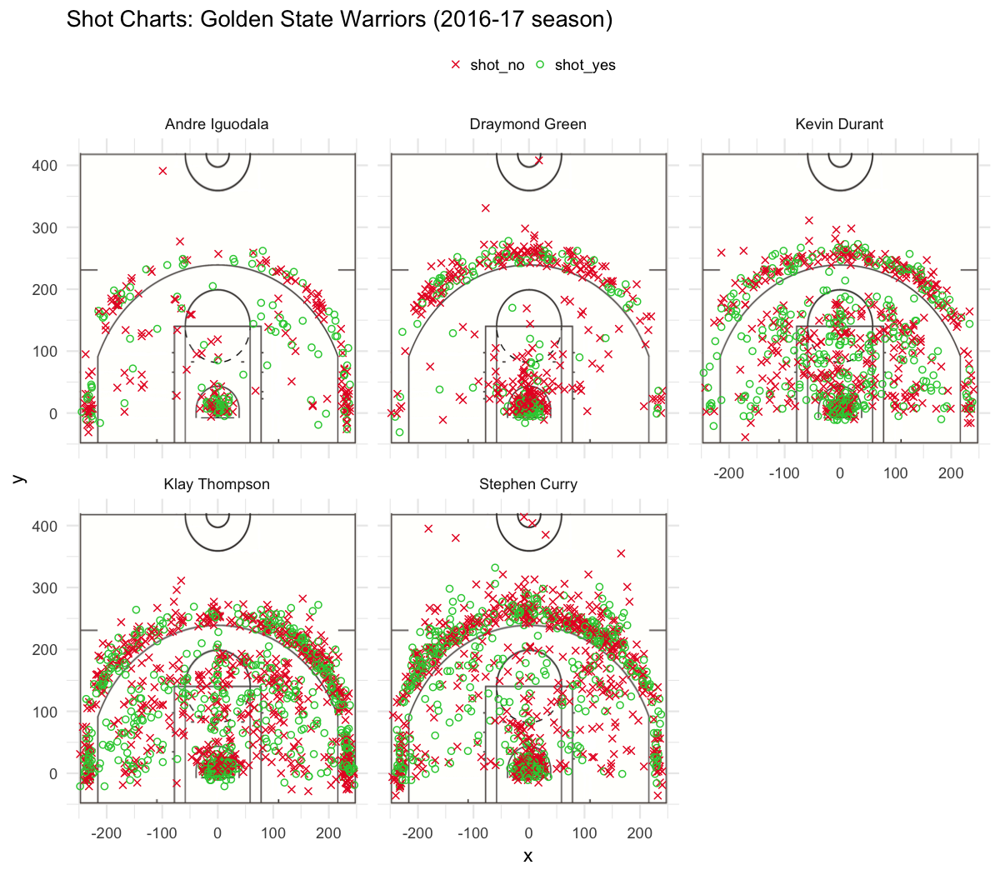

Workout 1
================
Isaac Schmidt
3/13/2019

The Three Splash Brothers
=========================

### Introduction

The 2016-17 Golden State Warriors featured a new and improved roster over the one that got upset by the Cleveland Cavaliers in the previous year's Finals. The offseason addition of free agent Kevin Durant more than made up for the departure of Harrison Barnes. While this edition of the Warriors did not match their record-setting 73-9 mark, this time they were able to easily overcome LeBron James and the Cavaliers over five games to win their second championship in three years.

The main reason for this success was excellent shooting, especially from long range. This article takes a look at shot charts and shooting percentages for the five players who played the most minutes for the Warriors—Klay Thompson, Stephen Curry, Draymond Green, Andre Iguodala, and the aforementioned Durant.

### Motivation

Casual sports fans perhaps might only start paying attention to local sports teams when they become good. As a child growing up in Philadelphia, it was interesting to see how many of my classmates suddenly became Phillies fans once they won the World Series in 2008. Many in Oakland and the rest of the Bay Area certainly know of the Warriors, and might recognize Curry or Durant on a highway billboard, but not much more. This article attempts to give a basic understanding of the roles played by different players. Who are "the Splash Brothers"? Is Stephen Curry really *the* best three-point shooter on the team?

### Data

The data for this analysis was obtained from [this GitHub repository](https://github.com/ucb-stat133/stat133-hws/tree/master/data). Each of the players has his own file, with one line for each shot he took throughout the season. Information about each shot included the time during the game the shot was taken, the type of shot, the location on the court, and of course, whether or not the shot was made. A selection of the data points for a few of Andre Iguodala's shots are shown below.

       shot_made_flag                    action_type shot_distance   x   y
    1               n            Alley Oop Dunk Shot             0   0   1
    21              y Cutting Finger Roll Layup Shot             1  10   8
    41              n     Driving Reverse Layup Shot             0   2   7
    61              n                 Jump Bank Shot             7  68  36
    81              n                      Jump Shot            25 -55 247

### Field Goal Percentages

With this data, basic stats like field goal percentage—the percentage of shots that a player hits—can be calculated. Below are tables showing overall field goal percentage for the five stars, followed by percentages for three-pointers and two-pointers, respectively.

##### All Shots

                name total made perc_made
    1   Kevin Durant   915  495 0.5409836
    2 Andre Iguodala   371  192 0.5175202
    3  Klay Thompson  1220  575 0.4713115
    4  Stephen Curry  1250  584 0.4672000
    5 Draymond Green   578  245 0.4238754

##### Three-Pointers

                name total made perc_made
    1  Klay Thompson   580  246 0.4241379
    2  Stephen Curry   687  280 0.4075691
    3   Kevin Durant   272  105 0.3860294
    4 Andre Iguodala   161   58 0.3602484
    5 Draymond Green   232   74 0.3189655

##### Two-Pointers

                name total made perc_made
    1 Andre Iguodala   210  134 0.6380952
    2   Kevin Durant   643  390 0.6065319
    3  Stephen Curry   563  304 0.5399645
    4  Klay Thompson   640  329 0.5140625
    5 Draymond Green   346  171 0.4942197

Some interesting trends pop out right away. Perhaps most surprising is that Stephen Curry is not in fact the Warriors' *best* three-point shooter. Yes, he takes more threes than anyone else, but it is Klay Thompson who shoots the higher percentage. One possible explanation for this is that opposing teams tend to close out on Curry, potentially at the expense of leaving Thompson alone for an open look. Curry, being the point guard is also the Warriors' main ball-handler. If the shot clock is winding down and the Warriors are in danger of a violation, the ball will likely be in Curry's hands and he will have to force up a deep contested shot that is unlikely to go in. If this happens a sufficient amount of times, he might lower his percentage significantly. Players are no doubt aware of this—before he was with the Warriors, Kevin Durant [admitted that he sometimes resists taking deep last-second shots as he doesn't want to risk lowering his shooting percentage](https://bleacherreport.com/articles/1526943-kevin-durant-claims-he-wont-always-shoot-high-risk-buzzer-beater-shots). Another option is that sometimes Curry simply overestimates his ability and takes worse shots as a result. If he's feeling hot, he might take a bad shot when a better option would be to pass to an open shooter or cutter. All basketball players, including those as good as Curry and Thompson, are humans too.

Another point worth noticing is that Draymond Green comes in last in all three categories, shooting below 32% from beyond the arc and below 50% within it. These numbers aren't exactly terrible, but they are a little bit lower than one might expect from a key player on one of the most dominant teams of all time. Why then does he play so much? Big men Zaza Pachulia and David West both shot around 54& from two-point range this year, and JaVale McGee shot a whopping 65%, which is even higher than the best starter. The answer is that Green is not really in the game to shoot. He just plays great defense instead. He is also what is commonly known as a "point forward"—instead of playing down low in the post, close to the basket like most "big men", Green can play on the outside, shooting and distributing the ball in a manner similar to a point guard. In reality, coming in fifth place on the Warriors' three-point shooting leaderboard isn't the worst thing in the world. Green still hit almost 25 times as many three-pointers as the three other players mentioned above, who combined to shoot 3 of 13.

### Shot Charts

Shown above is a shot chart for each of the five players. The first thing to notice is that Curry takes more shots than anyone else, including more shots from very deep positions. This does in fact help explain his slightly lower shooting percentage, as was suspected earlier.

However, one can not look at these charts and not notice the massive amount of green on Kevin Durant's chart compared to the others. Durant appears to have more success closer to the rim than anyone else, and is no slouch from three-point range either. The percentage statistics confirm this—Durant shot higher than 60% on two-point attempts, and more than 54% overall, the highest on the team. Most of this difference is made up with the mid-range shots—shots that are not high-percentage looks close to the basket, nor deep enough to warrant being worth an extra point. The mid-range jumper has fallen out of favor in the NBA in recent years because coaches and players have realized that it is not very efficient. That doesn not mean that having a good mid-range shot is a useless skill. In fact, quite the opposite is true. A good jump shot means that defenders have to respect it, so they might be more susceptible to fall for a ball fake, opening up a lane for the player to drive to the rim. It also worth mentioning that is really hard to block any kind of shot by the 6-foot-9-inch Durant. This is what confirms him as the third Splash Brother. It is not his 38.6% mark from three-point range, but his ability to hit the mid-range that not only gets points for himself but opens up the defense for his teammates that is what makes Durant so special.

### Conclusion

The Warriors are one of the greatest dynasties of all time, but they could not get it done against arguably the best player in the world in June 2016. What happened that offseason? They only signed the second best player in the world, and one of the best players of all time, giving them an entirely new dimension on offense. Deadly at the rim, decent from three, but very efficient from mid-range, Kevin Durant enabled the Warriors to easily dominate the NBA for their second title in three years.
